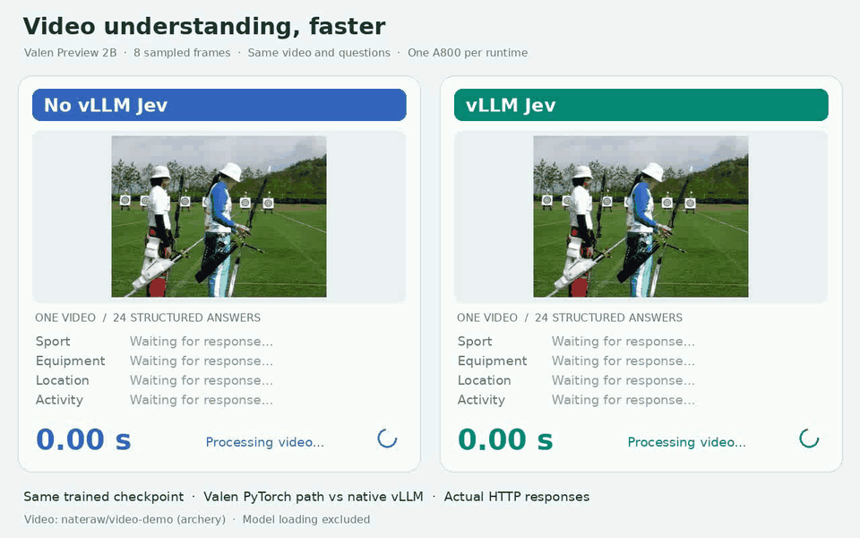
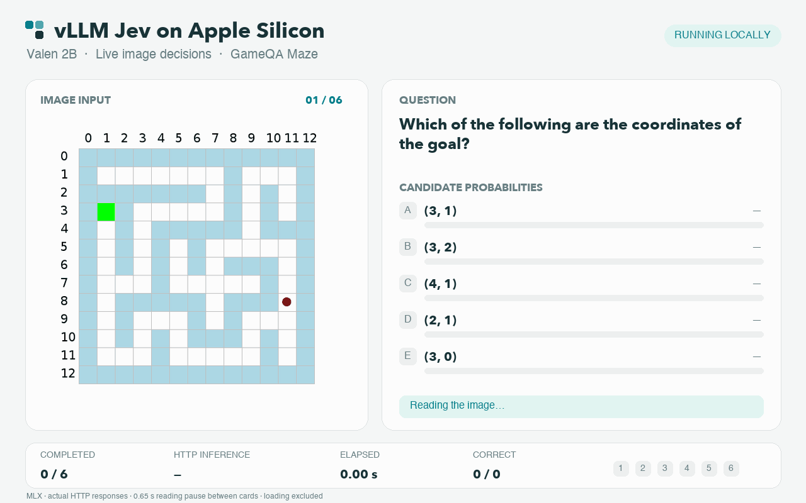

<h1 align="center">
  <picture>
    <source media="(prefers-color-scheme: dark)" srcset="docs/assets/vllm-jev-dark.svg">
    
  </picture>
</h1>

<h3 align="center">Fast structured decisions on Linux and Apple Silicon</h3>

<p align="center">
  <a href="docs/guide.md"><b>Documentation</b></a> ·
  <a href="#demos"><b>Demos</b></a> ·
  <a href="#getting-started"><b>Getting Started</b></a> ·
  <a href="#supported-models"><b>Supported Models</b></a> ·
  <a href="#example"><b>Example</b></a> ·
  <a href="#updates"><b>Updates</b></a>
</p>

---

## Demos

### Video understanding: live comparison



The same Valen checkpoint answers **24 structured questions about one video**, using eight sampled frames and one A800 per runtime. In this live run, Valen's PyTorch reference path took **5.31 s**, while vLLM Jev took **1.22 s** (**4.3× faster**); all 24 selected answers agreed. Model loading is excluded. [Watch the MP4](docs/assets/valen-video-live.mp4).

### Apple Silicon: live image decisions



Valen 2B answers six [GameQA Maze](https://huggingface.co/datasets/Valen-Team/Valen-Eval-General-5k) image questions locally on an Apple M5 using MLX. The display follows live HTTP responses. [Watch the MP4](docs/assets/mac-valen-maze-live.mp4).

### Multimodal: live Sokoban


Both runtimes played the same five levels from [Valen's Sokoban evaluation set](https://huggingface.co/datasets/Valen-Team/Valen-Eval-Game) with the same checkpoint and one A800 each.

### Text: 40 concurrent decisions


The [Open-Jev-2B](https://huggingface.co/ZefanCai/Open-Jev-2B) author HTTP server and vLLM Jev received the same 40 text-only Choice requests at once, on one A800 each.

## About

vLLM Jev serves compatible Jev-style checkpoints through [vLLM](https://github.com/vllm-project/vllm). Give it a question and candidate answers; it returns a label and a probability for each candidate.

- **Native vLLM serving on Linux:** scheduling, batching, compilation, KV cache, and metrics.
- **Apple Silicon preview:** run supported text models through MLX or PyTorch MPS, and Valen multimodal decisions through MLX.
- **Structured decisions:** Choice, Noul (yes/no), and Score (ordered levels) over HTTP.
- **Multimodal inference:** Valen, vjev, RSI-Jev v4.0-VL, and Clef accept text and images. Valen and Clef also accept [short videos](docs/guide.md#video-input); platform availability and request formats are model-specific.
- **Automatic setup:** start a supported Hugging Face model ID with one command.

## Getting Started

On Linux with an NVIDIA GPU, install vLLM Jev with [`uv`](https://docs.astral.sh/uv/) from the repository directory:

```bash
uv pip install .
```

For development, use an [editable installation](docs/guide.md#installation).

Start a server with a supported Hugging Face model ID:

```bash
vllm-jev serve ZefanCai/Open-Jev-2B
```

The command downloads and prepares the model, then starts native vLLM at `http://127.0.0.1:8795`. Later runs reuse the prepared checkpoint.

On an Apple Silicon Mac with macOS 15 or newer, set up once from the repository directory, then serve:

```bash
source scripts/install_mac.sh
vllm-jev serve Valen-Team/Valen-Preview-0923
```

The command downloads and prepares the model on first use. Send text or images to `/v1/systemone` for Choice, Noul, and Score decisions. For another Mac model, replace the model ID with a supported one from the table below.

<details>
<summary>GPU, port, and serving options</summary>

```bash
CUDA_VISIBLE_DEVICES=0 vllm-jev serve ZefanCai/Open-Jev-2B \
  --gpu-memory-utilization 0.90 --port 8795
```

Add standard `vllm serve` flags to override the defaults. See [serving options](docs/guide.md#serving-options) for storage locations and other flags.

</details>

Visit our [documentation](docs/guide.md) to learn more.

- [Installation](docs/guide.md#installation)
- [Quickstart](docs/guide.md#quickstart)
- [List of Supported Models](docs/guide.md#supported-models)

## Supported Models

Choose a checkpoint for your platform and run its command. Linux uses native vLLM; Apple Silicon uses MLX, or PyTorch MPS for Laya.

| Model | Input | Platform | Start server |
|---|---|---|---|
| [ZefanCai/Open-Jev-2B](https://huggingface.co/ZefanCai/Open-Jev-2B) | Text | Linux, Mac | `vllm-jev serve ZefanCai/Open-Jev-2B` |
| [ZefanCai/Open-Jev-9B](https://huggingface.co/ZefanCai/Open-Jev-9B) | Text | Linux | `vllm-jev serve ZefanCai/Open-Jev-9B` |
| [convaiinnovations/laya](https://huggingface.co/convaiinnovations/laya) | Text | Linux, Mac | `vllm-jev serve convaiinnovations/laya` |
| [convaiinnovations/laya-multilingual](https://huggingface.co/convaiinnovations/laya-multilingual) | Text | Linux, Mac | `vllm-jev serve convaiinnovations/laya-multilingual` |
| [convaiinnovations/laya-typed-decisions](https://huggingface.co/convaiinnovations/laya-typed-decisions) | Text | Linux, Mac | `vllm-jev serve convaiinnovations/laya-typed-decisions` |
| [IamBusy/OpenJev-0.6B](https://huggingface.co/IamBusy/OpenJev-0.6B) | Text | Linux, Mac | `vllm-jev serve IamBusy/OpenJev-0.6B` |
| [lostargon/Tiny-Jev](https://huggingface.co/lostargon/Tiny-Jev) | Text | Linux, Mac | `vllm-jev serve lostargon/Tiny-Jev` |
| [Valen-Team/Valen-Preview-0923](https://huggingface.co/Valen-Team/Valen-Preview-0923) | Text, images, video | Linux, Mac | `vllm-jev serve Valen-Team/Valen-Preview-0923` |
| [yah01/vjev-vision](https://huggingface.co/yah01/vjev-vision) | Text, images | Linux | `vllm-jev serve yah01/vjev-vision` |
| [yah01/vjev-vision-pilot](https://huggingface.co/yah01/vjev-vision-pilot) | Text, images | Linux | `vllm-jev serve yah01/vjev-vision-pilot` |

### Additional decision models (experimental)

These text-only checkpoints use the same command and `/v1/systemone` API for Choice, Noul, and Score. Listed platforms have been tested.

| Model | Tested platform | Start server |
|---|---|---|
| [jaredpalmer/kev-0.8b](https://huggingface.co/jaredpalmer/kev-0.8b) | Linux | `vllm-jev serve jaredpalmer/kev-0.8b` |
| [jaredpalmer/kev-4b](https://huggingface.co/jaredpalmer/kev-4b) | Linux | `vllm-jev serve jaredpalmer/kev-4b` |
| [Mapika/decider-0.8b](https://huggingface.co/Mapika/decider-0.8b) | Linux, Mac | `vllm-jev serve Mapika/decider-0.8b` |
| [Mapika/decider-2b](https://huggingface.co/Mapika/decider-2b) | Linux | `vllm-jev serve Mapika/decider-2b` |
| [sky7350/Mica-v0.1-4B](https://huggingface.co/sky7350/Mica-v0.1-4B) | Linux | `vllm-jev serve sky7350/Mica-v0.1-4B` |
| [flock-io/this-that-model-1.0](https://huggingface.co/flock-io/this-that-model-1.0) | Linux | `vllm-jev serve flock-io/this-that-model-1.0` |
| [flock-io/this-that-model-1.1](https://huggingface.co/flock-io/this-that-model-1.1) | Linux | `vllm-jev serve flock-io/this-that-model-1.1` |
| [flock-io/this-that-model-1.2](https://huggingface.co/flock-io/this-that-model-1.2) | Linux, Mac | `vllm-jev serve flock-io/this-that-model-1.2` |
| [alibiserikbay/JevK5](https://huggingface.co/alibiserikbay/JevK5) | Linux | `vllm-jev serve alibiserikbay/JevK5` |
| [alibiserikbay/JevK5-2B](https://huggingface.co/alibiserikbay/JevK5-2B) | Mac | `vllm-jev serve alibiserikbay/JevK5-2B` |

JevK5 currently supports **2–16 options** per question. In concurrent Linux batches, **Kev-0.8B can change its selected label**; This-That and Decider-2B can also change the most likely Score level. These consistency limits remain under investigation.

The optional CUDA setting `VLLM_JEV_BF16_MATMUL=no_splitk` can reduce batch-dependent numerical drift. Kev label changes can remain, including on A800. See [BF16 precision](docs/guide.md#cuda-bf16-matmul-precision) for usage and performance tradeoffs.

See the [model guide](docs/guide.md#additional-decision-checkpoints-experimental) for limits and request examples.

### RSI-Jev (experimental)

| Model | Input | Platform | Start server |
|---|---|---|---|
| [shgao/rsi-jev-v4.0-vl-qwen3.5-2b](https://huggingface.co/shgao/rsi-jev-v4.0-vl-qwen3.5-2b) | Text, images | Linux | `vllm-jev serve shgao/rsi-jev-v4.0-vl-qwen3.5-2b` |
| [shgao/rsi-jev-v3.0-qwen3.5-2b](https://huggingface.co/shgao/rsi-jev-v3.0-qwen3.5-2b) | Text | Linux | `vllm-jev serve shgao/rsi-jev-v3.0-qwen3.5-2b` |

The Linux adapter was contributed by [Shanghua Gao in PR #2](https://github.com/mode-io/vllm-jev/pull/2). See the [model guide](docs/guide.md#rsi-jev-experimental) for input limits and optional shared-state tokenization.

### Clef (experimental)

| Model | Input | Platform | Start server |
|---|---|---|---|
| [Cloudflare/clef-flash](https://huggingface.co/Cloudflare/clef-flash) (9B) | Text, images, video | Linux | `vllm-jev serve Cloudflare/clef-flash` |
| [Cloudflare/clef](https://huggingface.co/Cloudflare/clef) (27B) | Text, images, video | Linux | `vllm-jev serve Cloudflare/clef` |

Clef answers all questions about a state in one forward pass, returning a probability for each option. Its Linux adapter was contributed by [Arcobalneo in PR #4](https://github.com/mode-io/vllm-jev/pull/4). See the [model guide](docs/guide.md#clef-experimental) for request limits and image/video examples.

## Example

With the server running, send a Choice request:

```bash
curl -sS http://127.0.0.1:8795/v1/systemone \
  -H 'Content-Type: application/json' \
  -d '{"state":"I was charged twice and want a refund.","questions":{"intent":{"type":"choice","instructions":"Choose the customer intent.","criteria":{"billing":"A payment or refund issue","technical":"A malfunction or setup issue","other":"Another request"}}}}'
```

The response contains `answers.intent.choice` and `answers.intent.probabilities` for the supplied labels.

See the [user guide](docs/guide.md) for supported models, serving options, and Choice, Noul, and Score examples. The plugin targets **vLLM 0.29.0** and **Python 3.12+**.

For image questions, start a [supported vision model](docs/guide.md#supported-models) and follow its [image request example](docs/guide.md#text-and-images). [Short MP4 videos](docs/guide.md#video-input) are supported by Valen on Linux and Mac, and by Clef on Linux.

## Updates

### 2026-10-08

- Added optional cross-request prefix reuse on `/v1/systemone` for native Open-Jev, contributed by [Shelter Zhou / Sheltercosmo (PR #6)](https://github.com/mode-io/vllm-jev/pull/6). The [guide](docs/guide.md#shared-prefixes-across-system-one-requests) explains trusted salt assignment and limits.
- Rechecked Open-Jev-2B shared-prefix serving with 3,320 requests at up to 32 concurrent clients, covering mixed decision types, cache isolation, and client-disconnect recovery.

### 2026-10-05

- Added an experimental [online prefix cache](docs/guide.md#online-prefix-cache-experimental) for repeated Open-Jev-2B text requests on Linux, disabled by default.
- Added bounded cache eviction and state cleanup for cancellation, cache reset, and full-context pooling requests in the experimental path.
- Added an optional [CUDA BF16 precision mode](docs/guide.md#cuda-bf16-matmul-precision) to reduce batch-dependent rounding, contributed by [Qiao / wocqcm2 (PR #5)](https://github.com/mode-io/vllm-jev/pull/5).
- Kept precision settings fixed for each server process so compiled models use the intended mode. Restart the server to change it.

### 2026-10-04

- Fixed RSI-Jev requests at the context limit, cached model selection, and invalid media handling.
- Fixed the Linux helper installer and simplified the setup and model guides.
- Added [Clef 27B](https://huggingface.co/Cloudflare/clef) alongside Clef-Flash 9B, with text, image, and video decisions on Linux.
- Added experimental Linux serving for RSI-Jev v3.0/v4.0-VL by [Shanghua Gao (PR #2)](https://github.com/mode-io/vllm-jev/pull/2) and Clef-Flash by [Arcobalneo (PR #4)](https://github.com/mode-io/vllm-jev/pull/4).
- Added aggregate request limits for Clef and fixed platform and reference-test issues.
- Added optional [RSI-Jev shared-state tokenization](docs/guide.md#rsi-jev-experimental) to reduce preparation time for multi-question requests.

### 2026-09-29

- Added experimental adapters for [Kev, Decider, Mica, This-That, and JevK5](#additional-decision-models-experimental), with tested Linux and Mac availability listed above.

### 2026-09-28

- Added experimental video input for Valen on Linux and Apple Silicon, including variable-frame-rate clips. [Usage](docs/guide.md#video-input).

### 2026-09-27

- Improved Apple Silicon text serving with adaptive batching, prefix reuse, and bounded memory caching.
- Added optional CUDA Graph readouts for Laya multilingual on Linux.
- Added optional repeated-image reuse for Valen on Mac. See [serving options](docs/guide.md#optional-acceleration).

### 2026-09-26

- Added all three Laya checkpoints on Linux and Apple Silicon: English, multilingual, and typed decisions.
- Added Tiny-Jev serving on Apple Silicon with its marker readout.
- Added Open-Jev-2B serving on Apple Silicon with its scalar decision head.
- Added local text and image decisions on Apple Silicon with OpenJev-0.6B and Valen.
- Set up with one script, then start a model with the same `vllm-jev serve` command.
- Kept Mac server health checks responsive during inference.

### 2026-09-25

- Added multimodal decision inference with support for text and images.
- Added a fused Tiny-Jev head: **12.1% higher throughput** in the measured 16-option, 16-concurrent workload.
- On 500 Valen image questions, median latency fell from **231.9 to 77.3 ms** (**3.0×**) with **86.8% target-support accuracy** on both paths. [Results](#inference-performance).

## Inference performance

### Apple Silicon

Measured on an **Apple M5 with 16 GB unified memory**, using MLX: 96 text Choice requests for OpenJev and 42 GameQA Maze image questions for Valen. Requests are sequential after warmup; model loading is excluded.

| Model | Input | Latency (ms) | P95 (ms) | Throughput (req/s) |
|---|---|---:|---:|---:|
| OpenJev-0.6B | Text | 67.9 | 120.2 | 12.02 |
| Valen-Preview-0923 | Image | 205.9 | 249.7 | 4.64 |

Valen selected the same answers as the Linux reference on all 42 questions; both answered 17 correctly. Probability values differ between backends. Mac executes one model request at a time; concurrent requests queue.

### NVIDIA GPUs

Each row uses the same model, input, and A800 GPU for both paths. Lower latency and higher throughput are better. Measurement methods are noted below.

Paired values: **Without vLLM Jev → With vLLM Jev**.

| Model | Input | Concurrency | Latency (ms) | P95 (ms) | Throughput (req/s) | Speedup | Throughput gain |
|---|---|---:|---:|---:|---:|---:|---:|
| [Open-Jev-2B](https://huggingface.co/ZefanCai/Open-Jev-2B) | Short | 1 | 546.6 → 73.0 | 557.6 → 74.3 | 1.83 → 13.66 | 7.5× | 7.5× |
| [Open-Jev-2B](https://huggingface.co/ZefanCai/Open-Jev-2B) | Short | 8 | 4360.5 → 100.5 | 4451.8 → 105.2 | 1.83 → 78.83 | 43.4× | 43.1× |
| [Open-Jev-2B](https://huggingface.co/ZefanCai/Open-Jev-2B) | Long | 1 | 582.3 → 81.9 | 588.1 → 83.8 | 1.72 → 12.20 | 7.1× | 7.1× |
| [Open-Jev-2B](https://huggingface.co/ZefanCai/Open-Jev-2B) | Long | 8 | 4674.5 → 248.9 | 4745.4 → 272.2 | 1.71 → 31.65 | 18.8× | 18.5× |
| [Open-Jev-9B](https://huggingface.co/ZefanCai/Open-Jev-9B) | Short | 1 | 674.9 → 79.2 | 678.3 → 81.1 | 1.48 → 12.58 | 8.5× | 8.5× |
| [Open-Jev-9B](https://huggingface.co/ZefanCai/Open-Jev-9B) | Short | 8 | 5337.6 → 205.2 | 5393.2 → 207.4 | 1.50 → 38.87 | 26.0× | 26.0× |
| [Open-Jev-9B](https://huggingface.co/ZefanCai/Open-Jev-9B) | Long | 1 | 716.9 → 149.7 | 728.1 → 152.5 | 1.39 → 6.67 | 4.8× | 4.8× |
| [Open-Jev-9B](https://huggingface.co/ZefanCai/Open-Jev-9B) | Long | 8 | 5726.5 → 1016.6 | 5749.3 → 1019.3 | 1.40 → 7.87 | 5.6× | 5.6× |
| [Laya English](https://huggingface.co/convaiinnovations/laya)⁵ | MMLU sample | 1 | 26.6 → 10.3 | 28.0 → 12.6 | 37.61 → 94.79 | 2.6× | 2.5× |
| [Laya English](https://huggingface.co/convaiinnovations/laya)⁵ | MMLU sample | 16 | 404.5 → 77.5 | 416.0 → 98.8 | 39.55 → 202.87 | 5.2× | 5.1× |
| [Laya multilingual](https://huggingface.co/convaiinnovations/laya-multilingual)⁶ | MMLU sample | 1 | 22.4 → 9.8 | 24.0 → 11.1 | 44.63 → 100.11 | 2.3× | 2.2× |
| [Laya multilingual](https://huggingface.co/convaiinnovations/laya-multilingual)⁶ | MMLU sample | 16 | 339.8 → 75.5 | 350.6 → 96.0 | 47.03 → 209.53 | 4.5× | 4.5× |
| [Laya typed decisions](https://huggingface.co/convaiinnovations/laya-typed-decisions)⁶ | MMLU sample | 1 | 26.1 → 10.5 | 27.2 → 12.4 | 38.91 → 92.30 | 2.5× | 2.4× |
| [Laya typed decisions](https://huggingface.co/convaiinnovations/laya-typed-decisions)⁶ | MMLU sample | 16 | 401.2 → 83.1 | 413.4 → 101.3 | 39.83 → 193.34 | 4.8× | 4.9× |
| [OpenJev-0.6B](https://huggingface.co/IamBusy/OpenJev-0.6B)¹ | Short | 1 | 74.6 → 16.4 | 76.5 → 17.0 | 13.35 → 63.03 | 4.5× | 4.7× |
| [OpenJev-0.6B](https://huggingface.co/IamBusy/OpenJev-0.6B)¹ | Short | 8 | 583.2 → 37.5 | 601.6 → 49.3 | 13.62 → 198.70 | 15.5× | 14.6× |
| [OpenJev-0.6B](https://huggingface.co/IamBusy/OpenJev-0.6B)¹ | Long | 1 | 74.2 → 23.8 | 75.5 → 24.2 | 13.46 → 42.55 | 3.1× | 3.2× |
| [OpenJev-0.6B](https://huggingface.co/IamBusy/OpenJev-0.6B)¹ | Long | 8 | 584.5 → 67.9 | 598.0 → 70.6 | 13.63 → 117.24 | 8.6× | 8.6× |
| [Tiny-Jev](https://huggingface.co/lostargon/Tiny-Jev)² | Short | 1 | 28.5 → 10.2 | 29.0 → 17.8 | 35.03 → 88.45 | 2.8× | 2.5× |
| [Tiny-Jev](https://huggingface.co/lostargon/Tiny-Jev)² | Short | 8 | 216.9 → 28.8 | 222.0 → 45.7 | 36.61 → 254.99 | 7.5× | 7.0× |
| [Tiny-Jev](https://huggingface.co/lostargon/Tiny-Jev)² | Long | 1 | 28.4 → 11.5 | 30.1 → 12.4 | 34.59 → 85.70 | 2.5× | 2.5× |
| [Tiny-Jev](https://huggingface.co/lostargon/Tiny-Jev)² | Long | 8 | 223.0 → 43.3 | 224.3 → 59.7 | 35.75 → 179.94 | 5.1× | 5.0× |
| [Valen-Preview-0923](https://huggingface.co/Valen-Team/Valen-Preview-0923)³ | Image | 1 | 231.9 → 77.3 | 240.2 → 82.0 | 4.30 → 12.90 | 3.0× | 3.0× |
| [vjev-vision](https://huggingface.co/yah01/vjev-vision)⁴ | Image | 1 | 239.8 → 84.1 | 265.7 → 88.5 | 4.13 → 11.94 | 2.8× | 2.9× |
| [vjev-vision-pilot](https://huggingface.co/yah01/vjev-vision-pilot)⁴ | Image | 1 | 231.4 → 84.2 | 242.1 → 88.4 | 4.28 → 11.92 | 2.7× | 2.8× |

<details>
<summary>Benchmark notes</summary>

- ¹ OpenJev-0.6B uses the author's CUDA scorer as its baseline.
- ² Tiny-Jev uses a serialized HTTP wrapper around the author's Python API; gains include batching.
- ³ Valen uses sequential offline inference on 500 image questions. Both paths reached 86.8% target-support accuracy; choices agreed on 98.8%. Probability values differed, with a largest per-question difference of 0.295. HTTP time is excluded. A separate 500-request HTTP run at concurrency 8 reached 40.6 req/s (193.4 ms median latency).
- ⁴ vjev uses the author's Python scorer versus vLLM Jev HTTP on 100 identical game images and the same A800. Only the vLLM side includes HTTP time. This measures serving speed, not game accuracy.
- ⁵ Laya compares the published `laya-serve` 0.3.20 with vLLM Jev HTTP on the same A800 and 500 fixed four-choice questions. Labels differed on 6/500 questions; the largest option-probability difference was 0.0222. Laya's direct `predict_batch` SDK can be faster for many states sharing one question schema; the HTTP figures do not measure that bulk path. The optional TileLang fast path was unavailable with this server's CUDA toolkit.
- ⁶ The two additional Laya checkpoints use the same 500 English MMLU questions and A800 HTTP setup as ⁵. Their labels differed from the author's runtime on 7/500 (multilingual) and 2/500 (typed) questions. This tests serving on a shared English workload, not multilingual or typed-task quality.

</details>

## Contributing

Report bugs and feature requests in [Issues](https://github.com/mode-io/vllm-jev/issues). Use [Discussions](https://github.com/mode-io/vllm-jev/discussions) for questions and ideas. Submit code changes as [pull requests](https://github.com/mode-io/vllm-jev/pulls); the maintainer reviews them before merging.

## License

Apache-2.0. The Choice prompt follows MIT-licensed [Open-Jev](https://github.com/Zefan-Cai/Open-Jev); see [third-party notices](THIRD_PARTY_NOTICES.md).
